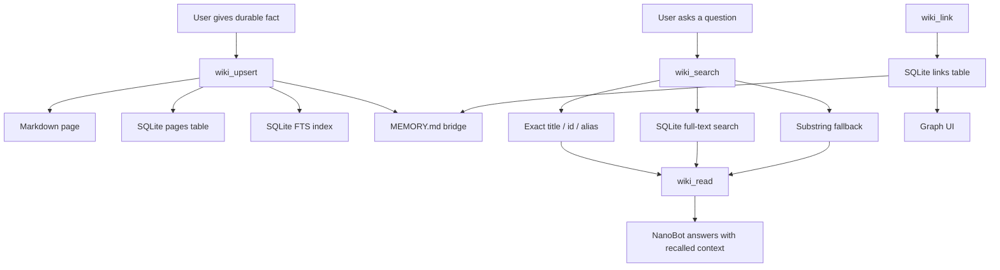

# NanoBot LLM Wiki

`nanobot-llm-wiki` is a deployable long-term memory plugin for
[NanoBot](https://github.com/HKUDS/nanobot). It turns durable memory into a local Wiki:
Markdown pages for humans, SQLite for search, and typed graph links for structure.

The project is intentionally simple to deploy. It does not require Postgres, a vector
database, Redis, Docker, or an external hosted service.

## Can Someone Deploy This With One Command?

Yes, for the plugin bootstrap:

```bash
curl -fsSL https://raw.githubusercontent.com/yu-xin-c/nanobot-llm-wiki/main/scripts/install.sh | bash
```

This command installs NanoBot with the plugin attached and initializes the Wiki workspace.
After that, start NanoBot normally:

```bash
nanobot gateway
```

What the one-command installer does:

- Installs `nanobot-ai` with this plugin attached via `uv tool install --with`.
- Creates `~/.nanobot/workspace/memory/wiki/`.
- Seeds starter Wiki pages: `User Profile`, `Projects`, and `Open Questions`.
- Writes the generated always-on skill at `~/.nanobot/workspace/skills/llm-wiki/SKILL.md`.
- Writes a `memory/MEMORY.md` bridge so NanoBot knows when to use Wiki tools.
- Registers these NanoBot tools through Python entry points: `wiki_search`, `wiki_read`,
  `wiki_upsert`, `wiki_link`, `wiki_import`, `wiki_forget`, and `wiki_status`.

What it does not do:

- It does not create or configure your LLM provider API key.
- It does not overwrite a custom `config.json`.
- It does not start a background UI service by itself.
- It does not automatically import your existing documents; use `nanobot-wiki import`
  after installation.
- It does not replace NanoBot core memory internals; it adds a tool-based Wiki memory layer.

## Prerequisites

- Python 3.11 or newer.
- [`uv`](https://docs.astral.sh/uv/) installed and available on `PATH`.
- A working NanoBot config at `~/.nanobot/config.json` with an LLM provider configured.

To install `uv`:

```bash
curl -LsSf https://astral.sh/uv/install.sh | sh
```

## Install Options

### Option A: One-command installer

```bash
curl -fsSL https://raw.githubusercontent.com/yu-xin-c/nanobot-llm-wiki/main/scripts/install.sh | bash
nanobot gateway
```

Use a custom workspace:

```bash
curl -fsSL https://raw.githubusercontent.com/yu-xin-c/nanobot-llm-wiki/main/scripts/install.sh \
  | NANOBOT_WORKSPACE=/path/to/workspace bash
```

Use a fork or another repo URL:

```bash
curl -fsSL https://raw.githubusercontent.com/yu-xin-c/nanobot-llm-wiki/main/scripts/install.sh \
  | NANOBOT_LLM_WIKI_REPO=https://github.com/your-name/nanobot-llm-wiki bash
```

### Option B: `uv tool` install

Use this when NanoBot itself is managed by `uv tool`:

```bash
uv tool install --force --with git+https://github.com/yu-xin-c/nanobot-llm-wiki nanobot-ai
uvx --from git+https://github.com/yu-xin-c/nanobot-llm-wiki nanobot-wiki install
nanobot gateway
```

### Option C: virtualenv or source checkout

```bash
python -m pip install git+https://github.com/yu-xin-c/nanobot-llm-wiki
nanobot-wiki install --workspace ~/.nanobot/workspace
nanobot gateway
```

For local development:

```bash
git clone https://github.com/yu-xin-c/nanobot-llm-wiki
cd nanobot-llm-wiki
uv sync --extra dev
uv run nanobot-wiki install --workspace ~/.nanobot/workspace
```

## Verify The Install

Check storage paths and counts:

```bash
nanobot-wiki status
```

Search the seeded pages:

```bash
nanobot-wiki search "Projects"
```

Start the local Wiki UI:

```bash
nanobot-wiki ui --workspace ~/.nanobot/workspace
```

Then open:

```text
http://127.0.0.1:8766
```

When NanoBot starts with `-v`, logs should include the Wiki tools:

```text
wiki_forget, wiki_import, wiki_link, wiki_read, wiki_search, wiki_status, wiki_upsert
```

## What Gets Installed

```text
~/.nanobot/workspace/
  memory/
    MEMORY.md                  # bridge block pointing NanoBot at the Wiki
    wiki/
      wiki.db                  # SQLite search/index database
      config.toml              # plugin settings scoped to this workspace
      pages/*.md               # human-editable Wiki pages
      archive/*.md             # archived forgotten pages
      .cursor                  # history ingestion cursor
  skills/
    llm-wiki/SKILL.md          # always-on guidance for when to use Wiki tools
```

## How It Works



### Memory write flow

1. NanoBot decides a fact is durable.
2. It calls `wiki_upsert`.
3. The plugin writes a Markdown page under `memory/wiki/pages/`.
4. The same page is indexed into SQLite `pages`.
5. Title, content, tags, and aliases are indexed for recall.
6. `MEMORY.md` is refreshed with active pages and recent graph links.
7. If a relationship matters, NanoBot calls `wiki_link`.

### Recall flow

1. NanoBot searches with `wiki_search(query=...)`.
2. The store tries exact page title, page id, and alias first.
3. It then runs precise SQLite FTS search.
4. It falls back to substring matching for edge cases.
5. NanoBot calls `wiki_read(selector=...)` before relying on full page details.

### Delete flow

1. NanoBot calls `wiki_forget(selector=...)`.
2. The page is removed from active SQLite `pages`.
3. The page is removed from full-text search.
4. Related graph links are removed.
5. By default, the Markdown file is moved to `memory/wiki/archive/`.
6. Use `archive=false` in the tool or `--delete` in the CLI for permanent file deletion.

### Knowledge base import flow

1. Run `nanobot-wiki import /path/to/docs` or ask NanoBot to call `wiki_import(path=...)`.
2. The importer recursively scans supported text files.
3. Each file becomes a stable Wiki page.
4. A generated index page is created for the imported knowledge base.
5. The index page links to every imported page with a typed `contains` relation.
6. Re-running the same import updates the same pages instead of creating duplicates.
7. `MEMORY.md` is refreshed so NanoBot can discover the new knowledge base.

## NanoBot Tools

| Tool | Purpose |
| --- | --- |
| `wiki_search(query, limit, tag)` | Search Wiki pages by title, content, tags, and aliases. |
| `wiki_read(selector)` | Read one full page by title, id, or alias. |
| `wiki_upsert(title, content, ...)` | Create, replace, or append to a Wiki page. |
| `wiki_link(from_selector, to_selector, relation)` | Create a typed graph edge between pages. |
| `wiki_import(path, index_title, tags, ...)` | Import a local text file or folder as a Wiki knowledge base. |
| `wiki_forget(selector, archive)` | Archive or delete a page and remove it from active recall. |
| `wiki_status()` | Show storage paths, page count, link count, and cursor state. |

## CLI

```bash
nanobot-wiki install
nanobot-wiki status
nanobot-wiki search "project preference"
nanobot-wiki read "User Profile"
nanobot-wiki upsert "Current Project" --content "Building a NanoBot memory plugin."
nanobot-wiki upsert "Current Project" --content "New fact." --mode append
nanobot-wiki import ./docs --index-title "Project Docs" --tag docs
nanobot-wiki link "User Profile" "Current Project" --relation working_on
nanobot-wiki forget "Current Project"
nanobot-wiki forget "Current Project" --delete
nanobot-wiki dream --once
nanobot-wiki ui
nanobot-wiki doctor
```

## One-command Knowledge Base Import

After installing the plugin, import an existing local knowledge base with one command:

```bash
nanobot-wiki import ./docs --index-title "Project Docs" --tag docs
```

This command creates:

- One index page, for example `Project Docs`.
- One Wiki page per imported file.
- `Project Docs -contains-> Imported Page` graph links.
- Search entries in SQLite FTS.
- Updated `MEMORY.md` bridge content.

Supported file extensions:

```text
.md, .markdown, .txt, .rst, .adoc, .csv, .json, .jsonl, .toml, .yaml, .yml
```

Example:

```bash
nanobot-wiki import ~/company-handbook \
  --index-title "Company Handbook" \
  --tag handbook \
  --tag imported
```

Re-importing the same folder is incremental and stable. The importer uses deterministic page
ids based on the source folder and relative file path, so changed files update existing Wiki
pages instead of creating duplicates.

Import options:

| Option | Purpose |
| --- | --- |
| `--index-title` | Title for the generated knowledge base index page. |
| `--tag` | Extra tag added to the index and imported pages. Can be repeated. |
| `--type` | Page type for imported document pages. Defaults to `knowledge-doc`. |
| `--relation` | Graph relation from index page to imported pages. Defaults to `contains`. |
| `--max-bytes` | Per-file import limit. Defaults to `512000`. |

Current importer scope:

- It imports UTF-8 text documents.
- It skips hidden files, unsupported extensions, oversized files, and non-UTF-8 files.
- PDF, Word, Excel, and web page crawling are not built in yet. Convert those sources to
  Markdown or text before importing.

## Local UI

The built-in UI is a zero-build local page served by the Python package:

```bash
nanobot-wiki ui --workspace ~/.nanobot/workspace
```

Open:

```text
http://127.0.0.1:8766
```

The UI supports:

- Page list and search.
- Page create/edit/archive.
- Tags, aliases, and page type fields.
- Manual page linking.
- Graph visualization backed by the SQLite `links` table.
- Draggable graph nodes with resettable local layout.

## Memory Strategy

- Store durable facts as small pages with stable titles, tags, and aliases.
- Use `mode="append"` for incremental facts.
- Use `mode="replace"` for corrected summaries.
- Prefer `wiki_search` followed by `wiki_read`; search results are previews.
- Link pages when relationships matter, for example:
  `Projects -tracks-> NanoBot LLM Wiki`.
- Keep uncertain or unresolved facts in an `Open Questions` page.
- Use `wiki_forget` when the user asks to forget something.
- Deleted pages are removed from active recall. With `archive=true`, Markdown is kept only as an audit archive.

## Storage Model

The Wiki is local-first:

- Markdown is the human-readable source of truth.
- SQLite provides indexed lookup and graph relations.
- The plugin does not send Wiki data to any extra service.
- Backups can be done by copying `~/.nanobot/workspace/memory/wiki/`.

SQLite tables:

| Table | Purpose |
| --- | --- |
| `pages` | Page metadata and content. |
| `page_fts` | Full-text recall index. |
| `links` | Directed typed graph edges between pages. |

## Example Conversation Behavior

User:

```text
Remember that this project should be deployable with one command.
```

NanoBot should call:

```text
wiki_upsert(title="NanoBot LLM Wiki Deployment Goal", ...)
```

Later, user:

```text
What was the deployment goal for the Wiki plugin?
```

NanoBot should call:

```text
wiki_search(query="deployment goal Wiki plugin")
wiki_read(selector="NanoBot LLM Wiki Deployment Goal")
```

## Development

From this repository:

```bash
uv sync --extra dev
uv run --extra dev pytest -q
uv run --extra dev ruff check src tests
uv build
```

Run the UI against a temporary workspace:

```bash
uv run nanobot-wiki --workspace /tmp/nanobot-wiki-demo install
uv run nanobot-wiki --workspace /tmp/nanobot-wiki-demo ui
```

## Troubleshooting

### `uv is required`

Install `uv` first:

```bash
curl -LsSf https://astral.sh/uv/install.sh | sh
```

### NanoBot starts but Wiki tools are missing

NanoBot discovers tools from the Python environment it runs in. Reinstall NanoBot with the
plugin attached:

```bash
uv tool install --force --with git+https://github.com/yu-xin-c/nanobot-llm-wiki nanobot-ai
```

Then restart:

```bash
nanobot gateway -v
```

### Search cannot find a memory

Check the page exists:

```bash
nanobot-wiki search "your query"
nanobot-wiki status
```

If the fact exists but search is weak, add a stable alias or tag:

```bash
nanobot-wiki upsert "Page Title" \
  --content "Updated summary." \
  --alias "short memorable name" \
  --tag project \
  --mode append
```

### Knowledge base import skipped files

The importer prints skipped files in JSON output. Common reasons:

- Unsupported extension.
- File is larger than `--max-bytes`.
- File is hidden.
- File is not valid UTF-8 text.

Convert binary documents to Markdown/text first, or increase the size limit:

```bash
nanobot-wiki import ./docs --max-bytes 2000000
```

### Delete still leaves a Markdown file

That is expected when archiving. `wiki_forget` defaults to `archive=true`, which removes the
page from active recall but moves the Markdown file to `memory/wiki/archive/`. Use permanent
deletion only when you really want no archive:

```bash
nanobot-wiki forget "Page Title" --delete
```

### UI port is already in use

Run on another port:

```bash
nanobot-wiki ui --port 8877
```

## Current Limitations

- This is a tool-based memory plugin, not a replacement for NanoBot core memory internals.
- `dream --once` deterministically imports `memory/history.jsonl`; it is not yet an LLM curator.
- There is no vector database in the first release.
- Knowledge base import is text-first; rich document parsing is planned but not included.
- Multi-user access control is inherited from the local NanoBot deployment model.

## Design Goals

- One-command setup for normal NanoBot users.
- Local-first memory that users can inspect, edit, back up, and delete.
- A Wiki structure that supports pages, tags, aliases, and typed graph links.
- Safe bootstrap path that does not require changing NanoBot core.
- A clean migration path toward a first-class NanoBot memory backend.
