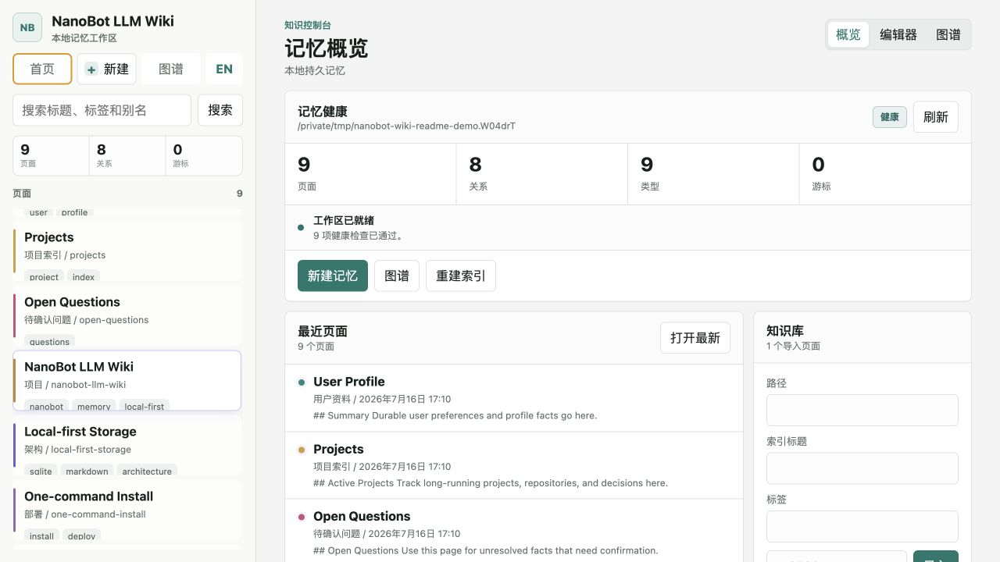
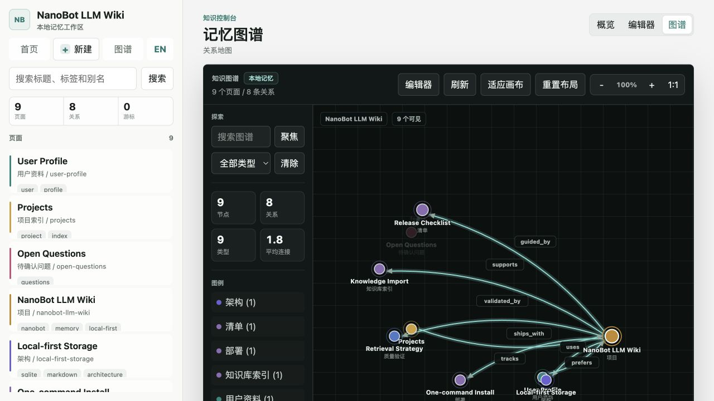
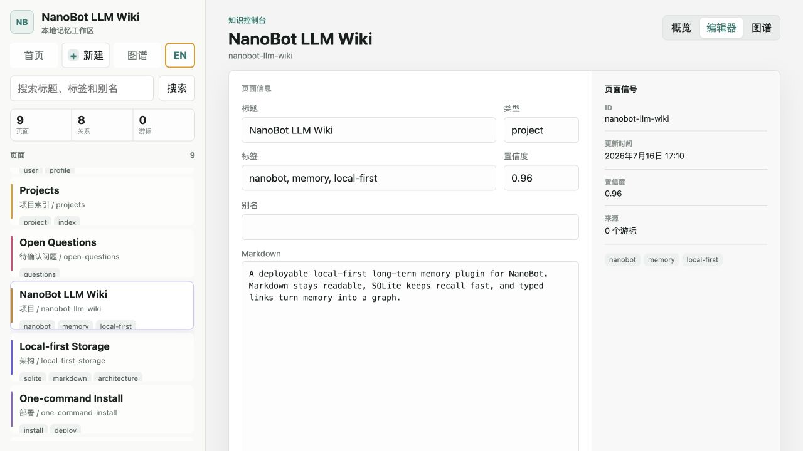
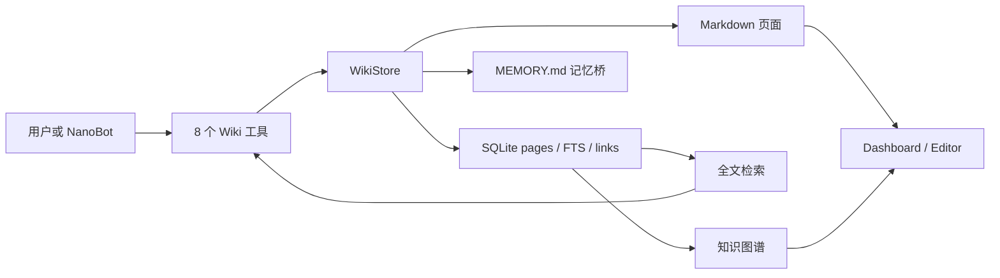

# NanoBot LLM Wiki

<p align="center">
  <strong>简体中文</strong> · <a href="README_EN.md">English</a>
</p>

<p align="center">
  
</p>

<p align="center">
  <strong>把 NanoBot 的长期记忆变成一个本地、可搜索、可编辑、可关联的 Wiki。</strong>
</p>

<p align="center">
  Markdown 保留可读原文，SQLite 提供快速检索，带类型的链接把零散记忆组织成知识图谱。
</p>

<p align="center">
  <a href="https://github.com/yu-xin-c/nanobot-llm-wiki/actions/workflows/ci.yml"></a>
  
  
  <a href="LICENSE"></a>
  
</p>

<p align="center">
  <a href="#快速开始">快速开始</a> ·
  <a href="#界面预览">界面预览</a> ·
  <a href="#工作原理">工作原理</a> ·
  <a href="#nanobot-工具">NanoBot 工具</a> ·
  <a href="#当前状态">项目状态</a>
</p>

> **一句话介绍：** NanoBot LLM Wiki 是一个面向 NanoBot 的本地优先长期记忆插件。它把用户偏好、项目背景、历史决策和导入文档保存为 Markdown 页面，并用 SQLite 全文检索和关系图谱帮助 Agent 在长对话之后仍能准确找回上下文。

## 为什么需要它

普通对话记忆往往有三个问题：上下文会被截断、历史事实难以核查、模型记住了什么不透明。
NanoBot LLM Wiki 增加了一层可以由人和 Agent 共同维护的持久知识空间：

- **本地优先**：页面、索引和图谱都保存在 NanoBot 工作区，不需要额外部署数据库服务。
- **人类可读**：每条记忆都有对应的 Markdown 文件，可以直接检查、编辑、备份和迁移。
- **可检索**：标题、正文、标签和别名进入 SQLite 全文索引，旧信息不必塞进每轮上下文。
- **可关联**：页面之间可以建立 `tracks`、`uses`、`depends_on` 等带类型关系。
- **可管理**：内置 Dashboard、页面编辑器、知识图谱、归档和索引修复界面。
- **双语界面**：顶部一键切换中文和英文，首次使用默认中文，并记住上次选择。
- **Agent 原生**：通过 NanoBot Python entry points 注册 8 个 Wiki 工具，无需修改 NanoBot 核心代码。

## 界面预览

### 记忆健康与知识库管理

Dashboard 汇总页面、关系、类型和导入状态，并提供安装诊断与索引修复入口。



### 可交互知识图谱

图谱使用圆点节点表达不同类型的记忆，支持拖拽、缩放、搜索、类型过滤、邻域聚焦和节点检查。



### 页面编辑器

页面内容使用 Markdown 保存，同时可以维护类型、标签、别名、置信度和图谱关系。



## 快速开始

### 一条命令安装

前提：机器上已经安装 [`uv`](https://docs.astral.sh/uv/)，并且
`~/.nanobot/config.json` 中已有可用的 NanoBot 模型配置。

```bash
curl -fsSL https://raw.githubusercontent.com/yu-xin-c/nanobot-llm-wiki/main/scripts/install.sh | bash
```

启动 NanoBot：

```bash
nanobot gateway
```

检查插件状态并打开管理界面：

```bash
nanobot-wiki doctor
nanobot-wiki ui --open
```

默认地址为 [http://127.0.0.1:8766](http://127.0.0.1:8766)。

### 安装后验证

```bash
nanobot-wiki status
nanobot-wiki search "Projects"
```

当 NanoBot 使用 `-v` 启动时，日志中应出现：

```text
wiki_doctor, wiki_forget, wiki_import, wiki_link,
wiki_read, wiki_search, wiki_status, wiki_upsert
```

## 安装方式

### 方式 A：一键安装

```bash
curl -fsSL https://raw.githubusercontent.com/yu-xin-c/nanobot-llm-wiki/main/scripts/install.sh | bash
```

指定工作区：

```bash
curl -fsSL https://raw.githubusercontent.com/yu-xin-c/nanobot-llm-wiki/main/scripts/install.sh \
  | NANOBOT_WORKSPACE=/path/to/workspace bash
```

使用 fork：

```bash
curl -fsSL https://raw.githubusercontent.com/yu-xin-c/nanobot-llm-wiki/main/scripts/install.sh \
  | NANOBOT_LLM_WIKI_REPO=https://github.com/your-name/nanobot-llm-wiki bash
```

安装脚本会通过 `uv tool install --force --with` 安装附带本插件的 NanoBot，并初始化 Wiki 工作区。
它不会替你创建模型 API key，也不会覆盖已有的 `config.json`。

### 方式 B：已有 virtualenv

```bash
python -m pip install git+https://github.com/yu-xin-c/nanobot-llm-wiki
nanobot-wiki --workspace ~/.nanobot/workspace install
nanobot gateway
```

### 方式 C：本地开发

```bash
git clone https://github.com/yu-xin-c/nanobot-llm-wiki
cd nanobot-llm-wiki
uv sync --extra dev
uv run nanobot-wiki --workspace ~/.nanobot/workspace install
```

## 第一次使用

### 让 NanoBot 记住长期事实

用户可以直接说：

```text
请记住，这个项目必须支持一条命令部署，并且所有数据默认保存在本地。
```

NanoBot 会使用 `wiki_upsert` 创建或更新页面。以后再问部署目标时，它会先通过
`wiki_search` 定位页面，再通过 `wiki_read` 读取完整内容。

### 从命令行写入和查询

```bash
nanobot-wiki upsert "Current Project" \
  --content "Building a local-first NanoBot memory plugin." \
  --tag project

nanobot-wiki search "local-first memory"
nanobot-wiki read "Current Project"
```

追加新事实：

```bash
nanobot-wiki upsert "Current Project" \
  --content "The first public release should include a health check." \
  --mode append
```

### 建立关系

```bash
nanobot-wiki link "Projects" "Current Project" --relation tracks
```

关系会写入 SQLite `links` 表，并显示在图谱界面中。

### 导入现有知识库

```bash
nanobot-wiki import ./docs \
  --index-title "Project Docs" \
  --tag docs
```

导入后会生成：

- 一个知识库索引页，例如 `Project Docs`。
- 每个文本文件对应的 Wiki 页面。
- 从索引页指向文档页的 `contains` 关系。
- 可由 `wiki_search` 使用的全文索引。
- 更新后的 `MEMORY.md` 记忆桥。

支持的文件扩展名：

```text
.md, .markdown, .txt, .rst, .adoc, .csv,
.json, .jsonl, .toml, .yaml, .yml
```

导入器会跳过隐藏文件、不支持的扩展名、超大文件和非 UTF-8 文件。当前版本不直接解析
PDF、Word、Excel 或网页，请先转换为 Markdown 或文本。只应导入你信任且确实希望交给
NanoBot 使用的目录。

## 工作原理



### 写入

1. NanoBot 判断某个事实值得长期保存。
2. `wiki_upsert` 创建、替换或追加 Wiki 页面。
3. Markdown 文件写入 `memory/wiki/pages/`。
4. 页面内容同步进入 SQLite `pages` 和 `page_fts`。
5. `MEMORY.md` 更新最近页面摘要，让 NanoBot 知道可以从 Wiki 召回信息。

### 召回

1. `wiki_search(query=...)` 先检查精确标题、页面 id 和别名。
2. SQLite FTS 对标题、正文、标签和别名运行全文检索。
3. 子串检索覆盖 FTS 无法命中的边缘情况。
4. NanoBot 使用 `wiki_read(selector=...)` 获取完整页面后再回答。

### 遗忘

1. `wiki_forget(selector=...)` 从活跃索引中移除页面。
2. 相关图谱关系和全文索引一并删除。
3. 默认将 Markdown 移入 `archive/`，便于审计和手工恢复。
4. 使用 CLI `--delete` 或工具参数 `archive=false` 才会永久删除页面文件。

### 手工编辑

Markdown 是可读文件，可以直接使用任意编辑器修改。手工改动后运行：

```bash
nanobot-wiki reindex
```

插件会从磁盘页面重建 SQLite 检索记录，并刷新记忆桥。

## NanoBot 工具

| 工具 | 用途 |
| --- | --- |
| `wiki_search(query, limit, tag)` | 搜索标题、正文、标签和别名。 |
| `wiki_read(selector)` | 通过标题、id 或别名读取完整页面。 |
| `wiki_upsert(title, content, ...)` | 创建、替换或追加页面。 |
| `wiki_link(from_selector, to_selector, relation)` | 创建带类型的页面关系。 |
| `wiki_import(path, index_title, tags, ...)` | 导入本地文本文件或目录。 |
| `wiki_forget(selector, archive)` | 归档或永久删除页面。 |
| `wiki_status()` | 返回工作区、页面、关系和游标状态。 |
| `wiki_doctor()` | 只读检查安装、数据库、索引、记忆桥和工具注册。 |

这些工具通过 `[project.entry-points."nanobot.tools"]` 注册，NanoBot 启动时会自动发现。

## CLI 参考

```bash
# 安装与健康检查
nanobot-wiki install
nanobot-wiki doctor
nanobot-wiki doctor --json
nanobot-wiki status

# 页面
nanobot-wiki search "project preference" --limit 5
nanobot-wiki search "memory" --tag project
nanobot-wiki read "User Profile"
nanobot-wiki upsert "Current Project" --content "Project summary."
nanobot-wiki upsert "Current Project" --content "New fact." --mode append
nanobot-wiki forget "Current Project"
nanobot-wiki forget "Current Project" --delete

# 图谱与导入
nanobot-wiki link "Projects" "Current Project" --relation tracks
nanobot-wiki import ./docs --index-title "Project Docs" --tag docs

# 索引、历史和 UI
nanobot-wiki reindex
nanobot-wiki dream --once
nanobot-wiki ui --open
nanobot-wiki ui --port 8877
```

所有命令都支持自定义工作区：

```bash
nanobot-wiki --workspace /path/to/workspace status
```

## 本地 UI

```bash
nanobot-wiki --workspace ~/.nanobot/workspace ui --open
```

UI 当前支持：

- 安装和索引健康检查。
- 页面列表、全文搜索、创建、编辑和归档。
- 页面类型、标签、别名和置信度。
- 本地文本知识库导入。
- 手动创建页面关系。
- 图谱搜索、类型过滤、节点拖拽、缩放、平移和小地图。
- 索引漂移的一键修复。
- 中文与英文一键切换，默认中文，并在浏览器中保留语言偏好。

默认只监听 `127.0.0.1`。除非已经配置额外访问控制，否则不要把 UI 直接绑定到公网地址。

## 存储布局

```text
~/.nanobot/workspace/
  memory/
    MEMORY.md                  # NanoBot 记忆桥，保留用户原有内容
    wiki/
      wiki.db                  # 页面、全文索引和图谱关系
      config.toml              # 工作区级插件配置占位
      pages/*.md               # 活跃 Wiki 页面
      archive/*.md             # 已归档页面
      .cursor                  # history.jsonl 导入游标
  skills/
    llm-wiki/SKILL.md          # Wiki 工具使用策略
```

Markdown 是便于检查和迁移的原始记录，SQLite 是可重建的检索与关系层。备份整个
`memory/wiki/` 目录即可保留页面、索引、关系和归档。

## 诊断与修复

```bash
nanobot-wiki doctor
```

`doctor` 是只读检查，会验证：

- 工作区、Wiki 目录和页面目录。
- SQLite 完整性和必要表。
- Markdown 页面与数据库索引是否一致。
- FTS 行数是否漂移。
- `MEMORY.md` 记忆桥。
- `llm-wiki` skill。
- 工作区配置文件。
- 8 个 NanoBot 工具 entry points。

检测到索引漂移时：

```bash
nanobot-wiki reindex
```

安装内容缺失时：

```bash
nanobot-wiki install
```

## 隐私与边界

- Wiki 页面和 SQLite 数据库默认保存在本机 NanoBot 工作区。
- 插件本身不增加独立的云数据库或遥测服务。
- NanoBot 在回答问题时可能把召回内容发送给你配置的 LLM 服务商，这取决于 NanoBot
  和模型供应商配置。`local-first` 不等于模型推理完全离线。
- `wiki_import` 会读取用户指定的本地文本路径，请只导入可信内容。
- `wiki_forget` 默认归档文件。涉及隐私删除时应使用永久删除模式，并检查备份。
- 当前 UI 面向本机单用户场景，没有内置多用户鉴权。

## 当前状态

项目目前处于 **Beta**，适合个人 NanoBot 工作区和本地开发环境。

已经可用：

- Markdown + SQLite 持久化。
- 精确匹配、全文检索和子串兜底。
- 8 个 NanoBot 工具。
- 页面管理、知识库导入、图谱和诊断 UI。
- 手工 Markdown 重建索引。
- CLI、工具注册和 HTTP API 自动化测试。

当前限制：

- `dream --once` 只做确定性 history 导入，还不是 LLM 策展器。
- 当前没有向量检索或 embedding 服务。
- 富文档解析尚未内置。
- 配置文件中的自动 dream、上下文预算和 embedding 字段仍为后续版本预留。
- 多用户鉴权、版本历史、回收站 UI 和完整导入同步仍在规划中。

## 开发

```bash
uv sync --extra dev
uv run --extra dev pytest -q
uv run --extra dev ruff check src tests
uv build
```

使用临时工作区运行 UI：

```bash
uv run nanobot-wiki --workspace /tmp/nanobot-wiki-demo install
uv run nanobot-wiki --workspace /tmp/nanobot-wiki-demo ui --open
```

CI 会在 push 和 pull request 时运行测试、Ruff 和包构建。

## 常见问题

### NanoBot 启动后没有 Wiki 工具

```bash
nanobot-wiki doctor
uv tool install --force \
  --with git+https://github.com/yu-xin-c/nanobot-llm-wiki \
  nanobot-ai
nanobot gateway -v
```

NanoBot 会从它实际运行的 Python 环境中发现工具，因此插件必须安装在同一个环境里。

### 搜索不到手工修改的内容

```bash
nanobot-wiki reindex
nanobot-wiki search "your query"
```

### UI 端口被占用

```bash
nanobot-wiki ui --port 8877 --open
```

### 导入文件被跳过

导入 JSON 结果会列出原因，常见情况包括不支持的扩展名、文件过大、隐藏文件和非 UTF-8
文本。可以在确认文件可信后提高单文件限制：

```bash
nanobot-wiki import ./docs --max-bytes 2000000
```

## License

[MIT](LICENSE)
