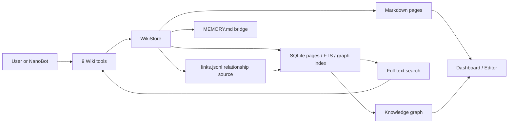

# NanoBot LLM Wiki

<p align="center">
  <a href="README.md">简体中文</a> · <strong>English</strong>
</p>

<p align="center">
  
</p>

<p align="center">
  <strong>Turn NanoBot's long-term memory into a local, searchable, editable, and connected Wiki.</strong>
</p>

<p align="center">
  Markdown keeps the source readable, SQLite makes recall fast, and typed links organize scattered memories into a knowledge graph.
</p>

<p align="center">
  <a href="https://github.com/yu-xin-c/nanobot-llm-wiki/actions/workflows/ci.yml"></a>
  
  
  <a href="LICENSE"></a>
  
</p>

<p align="center">
  <a href="#quick-start">Quick Start</a> ·
  <a href="#interface-preview">Interface</a> ·
  <a href="#how-it-works">Architecture</a> ·
  <a href="#nanobot-tools">NanoBot Tools</a> ·
  <a href="#project-status">Project Status</a>
</p>

> **Why this exists:** NanoBot's [official memory design](https://github.com/HKUDS/nanobot/blob/main/docs/memory.md) already provides layered storage, Dream consolidation, and Git-backed history, but its native memory is still centered on `history.jsonl` and Markdown files and does not yet include a user-facing, topic-oriented Wiki, relationship graph, or visual management interface. Meanwhile, OpenClaw ships [`memory-wiki`](https://docs.openclaw.ai/plugins/memory-wiki) as a bundled plugin that adds a maintained, structured Wiki layer beside active memory, providing a clear open-source precedent for this product direction.

> **In one sentence:** NanoBot LLM Wiki brings that pattern to NanoBot. It stores user preferences, project context, past decisions, and imported documents as local Markdown pages, then adds SQLite full-text search, a relationship graph, and a visual interface so people and agents can search, verify, edit, and continuously maintain long-term memory.

## Why This Plugin

Conversation memory commonly has three problems: context gets truncated, old facts are difficult to verify, and users cannot clearly see what the model remembers. NanoBot LLM Wiki adds a durable knowledge space that both people and agents can maintain:

- **Local first:** pages, indexes, and relationships stay inside the NanoBot workspace. No separate database service is required.
- **Human readable:** every memory has a Markdown source file that can be inspected, edited, backed up, and migrated.
- **Searchable:** titles, content, tags, and aliases are indexed by SQLite full-text search.
- **Connected:** pages can use typed relationships such as `tracks`, `uses`, and `depends_on`.
- **Manageable:** the built-in UI includes a dashboard, page editor, knowledge graph, archive actions, imports, and index repair.
- **Bilingual:** switch the whole interface between Chinese and English from the header. Chinese is the first-run default, and the browser remembers the selection.
- **Agent native:** nine Wiki tools are registered through NanoBot Python entry points without patching NanoBot core.

## Interface Preview

These are screenshots from the real frontend running against a clean demo workspace.

### Memory Health And Knowledge Base Management

The dashboard summarizes pages, links, types, import state, installation health, and index repair actions.


### Interactive Knowledge Graph

Circular nodes represent memory types. The graph supports drag, zoom, pan, search, type filters, neighborhood focus, a minimap, and node inspection.


### Markdown Page Editor

Edit Markdown content together with page type, tags, aliases, confidence, and typed graph relationships.


## Quick Start

### Install With One Command

The only installation prerequisite is [`uv`](https://docs.astral.sh/uv/). A model API key is
needed before NanoBot starts, but not while installing this plugin.

```bash
curl -fsSL https://raw.githubusercontent.com/yu-xin-c/nanobot-llm-wiki/main/scripts/install.sh | bash
```

The installer adds NanoBot when it is missing, attaches the plugin to uv's NanoBot Python
environment, exposes `nanobot-wiki`, initializes the workspace, and runs `doctor`. Existing uv
NanoBot plugins and Wiki data are preserved, and rerunning the command is a safe update.

If the installer reports that uv's command directory is not on `PATH`, run this once:

```bash
uv tool update-shell
```

Before the first NanoBot launch, complete the model setup. Skip this if NanoBot is already configured:

```bash
nanobot onboard
```

Then start NanoBot:

```bash
nanobot gateway
```

Open the Wiki management UI:

```bash
nanobot-wiki ui --open
```

The default URL is [http://127.0.0.1:8766](http://127.0.0.1:8766). The interface starts in Chinese on first use; select `EN` in the header to switch to English.

### Verify The Installation

The installer already runs a complete diagnostic pass. You can repeat it at any time:

```bash
nanobot-wiki doctor
nanobot-wiki status
nanobot-wiki search "Projects"
```

When NanoBot starts with `-v`, its log should list:

```text
wiki_doctor, wiki_forget, wiki_import, wiki_link,
wiki_read, wiki_search, wiki_status, wiki_unlink, wiki_upsert
```

## Installation And Maintenance

### Customize The Installer

Use a custom workspace:

```bash
curl -fsSL https://raw.githubusercontent.com/yu-xin-c/nanobot-llm-wiki/main/scripts/install.sh \
  | NANOBOT_WORKSPACE=/path/to/workspace bash
```

Install from a fork:

```bash
curl -fsSL https://raw.githubusercontent.com/yu-xin-c/nanobot-llm-wiki/main/scripts/install.sh \
  | NANOBOT_LLM_WIKI_REPO=https://github.com/your-name/nanobot-llm-wiki bash
```

The installer does not create model API keys, overwrite `config.json`, replace user-maintained
`MEMORY.md` content, modify Wiki pages, or overwrite a custom skill. It only updates its marked
memory bridge and generated skill.

### Upgrade

Rerun the Quick Start installer command. It updates only the Wiki package in NanoBot's environment,
preserves the workspace and other plugins, and runs diagnostics again.

After `uv tool upgrade nanobot-ai`, rerun this project's installer as well. uv may rebuild NanoBot's
isolated environment during an upgrade; the installer safely reattaches the Wiki plugin.

### Uninstall

```bash
curl -fsSL https://raw.githubusercontent.com/yu-xin-c/nanobot-llm-wiki/main/scripts/uninstall.sh | bash
```

The uninstaller removes the generated memory bridge, generated skill, plugin package, and
`nanobot-wiki` command. It keeps NanoBot, other plugins, and all data under `memory/wiki/`, so a
later reinstall reconnects the existing Wiki. Pass the same `NANOBOT_WORKSPACE` when uninstalling
from a custom workspace.

Delete the retained data only when you are certain it is no longer needed:

```bash
rm -rf ~/.nanobot/workspace/memory/wiki
```

### Existing Virtual Environment

```bash
python -m pip install git+https://github.com/yu-xin-c/nanobot-llm-wiki
nanobot-wiki --workspace ~/.nanobot/workspace install
nanobot gateway
```

### Local Development

```bash
git clone https://github.com/yu-xin-c/nanobot-llm-wiki
cd nanobot-llm-wiki
uv sync --extra dev
uv run nanobot-wiki --workspace ~/.nanobot/workspace install
```

## First Use

### Ask NanoBot To Remember A Durable Fact

For example:

```text
Remember that this project must support one-command deployment and store all data locally by default.
```

NanoBot can use `wiki_upsert` to create or update a page. When the deployment goal comes up later, it can locate the page with `wiki_search` and read the full source with `wiki_read`.

### Write And Query From The CLI

```bash
nanobot-wiki upsert "Current Project" \
  --content "Building a local-first NanoBot memory plugin." \
  --tag project

nanobot-wiki search "local-first memory"
nanobot-wiki read "Current Project"
```

Append a new fact:

```bash
nanobot-wiki upsert "Current Project" \
  --content "The first public release should include a health check." \
  --mode append
```

### Create A Relationship

```bash
nanobot-wiki link "Projects" "Current Project" --relation tracks
nanobot-wiki unlink "Projects" "Current Project" --relation tracks
```

The relationship is persisted in portable `links.jsonl`, indexed in SQLite, and shown in the graph UI. Omit `--relation` from `unlink` to remove every directed link between the two pages.

### Import A Knowledge Base

```bash
nanobot-wiki import ./docs \
  --index-title "Project Docs" \
  --tag docs
```

An import creates:

- A knowledge-base index page such as `Project Docs`.
- One Wiki page per supported text file.
- A `contains` relationship from the index page to each document page.
- Full-text records available to `wiki_search`.
- An updated `MEMORY.md` bridge.

Supported extensions:

```text
.md, .markdown, .txt, .rst, .adoc, .csv,
.json, .jsonl, .toml, .yaml, .yml
```

The importer skips hidden files, unsupported extensions, oversized files, and non-UTF-8 text. PDF, Word, Excel, and web pages are not parsed directly yet; convert them to Markdown or plain text first. Only import directories you trust and intend to expose to NanoBot.

## How It Works



### Write Path

1. NanoBot decides that a fact deserves durable storage.
2. `wiki_upsert` creates, replaces, or appends a Wiki page.
3. A Markdown file is written under `memory/wiki/pages/`.
4. The content is synchronized to SQLite `pages` and `page_fts`.
5. `MEMORY.md` receives a recent-page summary so NanoBot knows what can be recalled.

### Recall Path

1. `wiki_search(query=...)` checks exact title, page id, and aliases.
2. SQLite FTS searches titles, content, tags, and aliases.
3. Substring matching covers edge cases that FTS may miss.
4. NanoBot reads the complete source with `wiki_read(selector=...)` before answering.

### Forget Path

1. `wiki_forget(selector=...)` removes a page from active indexes.
2. Related graph links and full-text entries are removed from the active SQLite index.
3. The Markdown file moves to `archive/` by default while portable link records remain available for audit and manual recovery.
4. CLI `--delete` or tool argument `archive=false` permanently removes the source file and its relationship records.

### Manual Markdown Edits

Markdown is the readable source of truth and can be edited with any text editor. Rebuild SQLite records after manual changes:

```bash
nanobot-wiki reindex
```

## NanoBot Tools

| Tool | Purpose |
| --- | --- |
| `wiki_search(query, limit, tag)` | Search titles, content, tags, and aliases. |
| `wiki_read(selector)` | Read a complete page by title, id, or alias. |
| `wiki_upsert(title, content, ...)` | Create, replace, or append a page. |
| `wiki_link(from_selector, to_selector, relation)` | Create a typed page relationship. |
| `wiki_unlink(from_selector, to_selector, relation)` | Remove one relation, or all directed links when relation is omitted. |
| `wiki_import(path, index_title, tags, ...)` | Import a local text file or directory. |
| `wiki_forget(selector, archive)` | Archive or permanently delete a page. |
| `wiki_status()` | Return workspace, page, link, and cursor status. |
| `wiki_doctor()` | Read-only installation, database, index, bridge, and registration checks. |

The tools are registered through `[project.entry-points."nanobot.tools"]` and discovered automatically when NanoBot starts.

## CLI Reference

```bash
# Setup and health
nanobot-wiki install
nanobot-wiki doctor
nanobot-wiki doctor --json
nanobot-wiki status

# Pages
nanobot-wiki search "project preference" --limit 5
nanobot-wiki search "memory" --tag project
nanobot-wiki read "User Profile"
nanobot-wiki upsert "Current Project" --content "Project summary."
nanobot-wiki upsert "Current Project" --content "New fact." --mode append
nanobot-wiki forget "Current Project"
nanobot-wiki forget "Current Project" --delete

# Graph and import
nanobot-wiki link "Projects" "Current Project" --relation tracks
nanobot-wiki unlink "Projects" "Current Project" --relation tracks
nanobot-wiki import ./docs --index-title "Project Docs" --tag docs

# Index, history, and UI
nanobot-wiki reindex
nanobot-wiki dream --once
nanobot-wiki ui --open
nanobot-wiki ui --port 8877
nanobot-wiki ui --read-only
```

Every command supports a custom workspace:

```bash
nanobot-wiki --workspace /path/to/workspace status
```

## Local UI

```bash
nanobot-wiki --workspace ~/.nanobot/workspace ui --open
```

The interface currently includes:

- Installation and index health checks.
- Page listing, full-text search, create, edit, and archive actions.
- Page types, tags, aliases, and confidence.
- Local text knowledge-base imports.
- Create and remove typed relationships.
- Graph search, type filters, node drag, zoom, pan, and minimap.
- One-click index drift repair.
- One-click Chinese and English switching with a persisted browser preference.
- Read-only shared demos and reverse-proxy subpaths such as `/wiki/`.

The server listens on `127.0.0.1` by default. Use `--read-only` for public demos. For online editing, put the UI behind HTTPS and additional access controls instead of binding the management interface directly to a public address.

## Storage Layout

```text
~/.nanobot/workspace/
  memory/
    MEMORY.md                  # NanoBot memory bridge; preserves existing content
    wiki/
      wiki.db                  # Rebuildable page, full-text, and graph indexes
      links.jsonl              # Portable, version-friendly relationship source
      config.toml              # Workspace-level plugin configuration placeholder
      pages/*.md               # Active Wiki pages
      archive/*.md             # Archived pages
      .cursor                  # history.jsonl import cursor
  skills/
    llm-wiki/SKILL.md          # Wiki tool usage policy
```

Markdown pages and `links.jsonl` are the inspectable, portable sources. SQLite is a rebuildable page, search, and graph index. Back up the complete `memory/wiki/` directory to preserve pages, indexes, links, and archives.

## Diagnostics And Repair

```bash
nanobot-wiki doctor
```

`doctor` is read-only and checks:

- Workspace, Wiki, and Markdown page directories.
- SQLite integrity and required tables.
- Agreement between Markdown pages and database records.
- FTS row drift.
- Validity and active-index agreement of `links.jsonl`.
- The `MEMORY.md` bridge.
- The `llm-wiki` skill.
- Workspace configuration.
- All nine NanoBot tool entry points.

Repair index drift:

```bash
nanobot-wiki reindex
```

Restore missing setup files:

```bash
nanobot-wiki install
```

## Privacy And Boundaries

- Wiki pages, relationship sources, and SQLite data stay in the local NanoBot workspace by default.
- The plugin adds no independent cloud database or telemetry service.
- Recalled content may still be sent to the LLM provider configured in NanoBot. Local-first storage does not mean fully offline model inference.
- `wiki_import` reads a user-selected local path. Import trusted content only.
- `wiki_forget` archives by default. For privacy deletion, use permanent delete and review backups.
- The current UI targets a single local user and does not include multi-user authentication.

## Project Status

The project is currently **Beta** and targets personal NanoBot workspaces and local development environments.

Available now:

- Markdown and JSONL persistence with rebuildable SQLite indexes.
- Exact match, full-text search, and substring fallback.
- Nine NanoBot tools.
- Page management, knowledge imports, graph, diagnostics, and bilingual UI.
- Index rebuild after manual Markdown edits.
- Automated CLI, registration, storage, HTTP API, and real isolated NanoBot installation tests.

Current limitations:

- `dream --once` performs deterministic history import, not LLM curation.
- Vector search and embedding services are not included.
- Rich document parsing is not built in.
- Automatic dream, context budget, and embedding configuration fields are reserved for later versions.
- Multi-user authentication, version history, a recycle-bin UI, and full import synchronization are still planned.

## Development

```bash
uv sync --extra dev
uv run --extra dev pytest -q
uv run --extra dev ruff check src tests
bash tests/smoke_install.sh
uv build
```

Run the UI with a temporary workspace:

```bash
uv run nanobot-wiki --workspace /tmp/nanobot-wiki-demo install
uv run nanobot-wiki --workspace /tmp/nanobot-wiki-demo ui --open
```

CI runs unit tests, Ruff, a NanoBot installation smoke test, and package builds on pushes and pull requests.

## FAQ

### NanoBot Does Not Show The Wiki Tools

```bash
curl -fsSL https://raw.githubusercontent.com/yu-xin-c/nanobot-llm-wiki/main/scripts/install.sh | bash
nanobot-wiki doctor
nanobot gateway -v
```

NanoBot discovers tools from its active Python environment. Rerunning the installer attaches the
plugin to that environment while preserving its other extensions.

### Search Misses A Manually Edited Page

```bash
nanobot-wiki reindex
nanobot-wiki search "your query"
```

### The Default UI Port Is In Use

```bash
nanobot-wiki ui --port 8877 --open
```

### An Import File Was Skipped

The import result reports the reason. Common causes include an unsupported extension, excessive file size, a hidden file, or non-UTF-8 text. Increase the per-file limit only after checking the source:

```bash
nanobot-wiki import ./docs --max-bytes 2000000
```

## License

[MIT](LICENSE)
