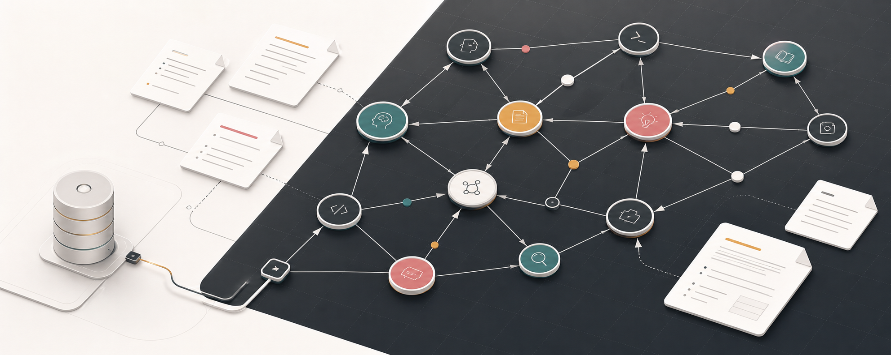
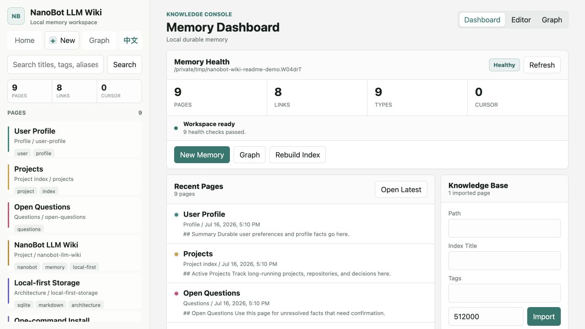
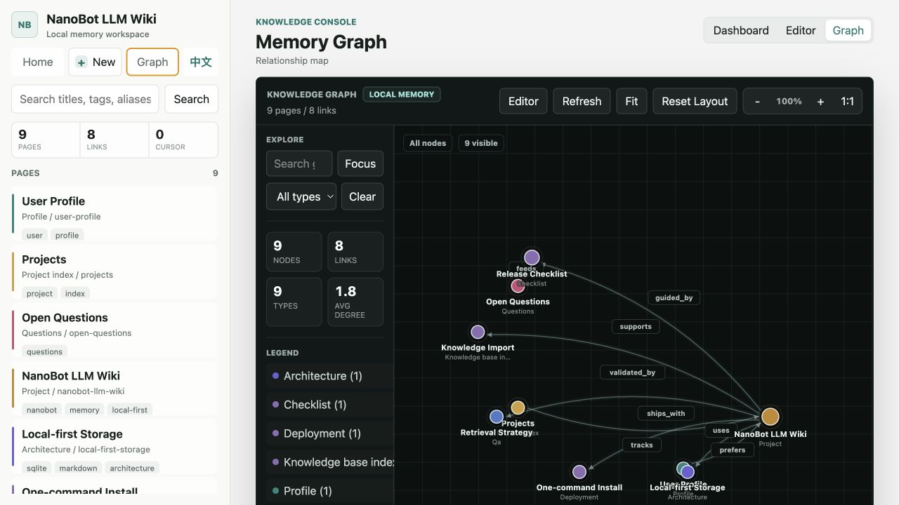
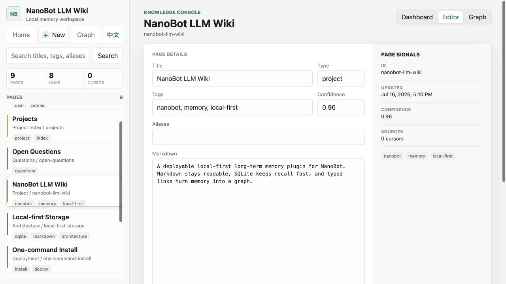
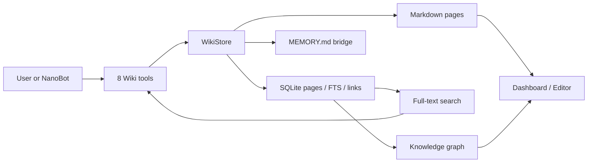

# NanoBot LLM Wiki

<p align="center">
  <a href="README.md">简体中文</a> · <strong>English</strong>
</p>

<p align="center">
  
</p>

<p align="center">
  <strong>Turn NanoBot's long-term memory into a local, searchable, editable, and connected Wiki.</strong>
</p>

<p align="center">
  Markdown keeps the source readable, SQLite makes recall fast, and typed links organize scattered memories into a knowledge graph.
</p>

<p align="center">
  <a href="https://github.com/yu-xin-c/nanobot-llm-wiki/actions/workflows/ci.yml"></a>
  
  
  <a href="LICENSE"></a>
  
</p>

<p align="center">
  <a href="#quick-start">Quick Start</a> ·
  <a href="#interface-preview">Interface</a> ·
  <a href="#how-it-works">Architecture</a> ·
  <a href="#nanobot-tools">NanoBot Tools</a> ·
  <a href="#project-status">Project Status</a>
</p>

> **In one sentence:** NanoBot LLM Wiki is a local-first long-term memory plugin for NanoBot. It stores user preferences, project context, past decisions, and imported documents as Markdown pages, then uses SQLite full-text search and a relationship graph to recover the right context after long conversations.

## Why This Plugin

Conversation memory commonly has three problems: context gets truncated, old facts are difficult to verify, and users cannot clearly see what the model remembers. NanoBot LLM Wiki adds a durable knowledge space that both people and agents can maintain:

- **Local first:** pages, indexes, and relationships stay inside the NanoBot workspace. No separate database service is required.
- **Human readable:** every memory has a Markdown source file that can be inspected, edited, backed up, and migrated.
- **Searchable:** titles, content, tags, and aliases are indexed by SQLite full-text search.
- **Connected:** pages can use typed relationships such as `tracks`, `uses`, and `depends_on`.
- **Manageable:** the built-in UI includes a dashboard, page editor, knowledge graph, archive actions, imports, and index repair.
- **Bilingual:** switch the whole interface between Chinese and English from the header. Chinese is the first-run default, and the browser remembers the selection.
- **Agent native:** eight Wiki tools are registered through NanoBot Python entry points without patching NanoBot core.

## Interface Preview

These are screenshots from the real frontend running against a clean demo workspace.

### Memory Health And Knowledge Base Management

The dashboard summarizes pages, links, types, import state, installation health, and index repair actions.



### Interactive Knowledge Graph

Circular nodes represent memory types. The graph supports drag, zoom, pan, search, type filters, neighborhood focus, a minimap, and node inspection.



### Markdown Page Editor

Edit Markdown content together with page type, tags, aliases, confidence, and typed graph relationships.



## Quick Start

### Install With One Command

Prerequisites:

- [`uv`](https://docs.astral.sh/uv/) is installed.
- `~/.nanobot/config.json` already contains a working NanoBot model configuration.

```bash
curl -fsSL https://raw.githubusercontent.com/yu-xin-c/nanobot-llm-wiki/main/scripts/install.sh | bash
```

Start NanoBot:

```bash
nanobot gateway
```

Check the plugin and open its management UI:

```bash
nanobot-wiki doctor
nanobot-wiki ui --open
```

The default URL is [http://127.0.0.1:8766](http://127.0.0.1:8766). The interface starts in Chinese on first use; select `EN` in the header to switch to English.

### Verify The Installation

```bash
nanobot-wiki status
nanobot-wiki search "Projects"
```

When NanoBot starts with `-v`, its log should list:

```text
wiki_doctor, wiki_forget, wiki_import, wiki_link,
wiki_read, wiki_search, wiki_status, wiki_upsert
```

## Installation Options

### Option A: Installer Script

```bash
curl -fsSL https://raw.githubusercontent.com/yu-xin-c/nanobot-llm-wiki/main/scripts/install.sh | bash
```

Use a custom workspace:

```bash
curl -fsSL https://raw.githubusercontent.com/yu-xin-c/nanobot-llm-wiki/main/scripts/install.sh \
  | NANOBOT_WORKSPACE=/path/to/workspace bash
```

Install from a fork:

```bash
curl -fsSL https://raw.githubusercontent.com/yu-xin-c/nanobot-llm-wiki/main/scripts/install.sh \
  | NANOBOT_LLM_WIKI_REPO=https://github.com/your-name/nanobot-llm-wiki bash
```

The installer uses `uv tool install --force --with` to install NanoBot with this plugin and initialize the Wiki workspace. It does not create a model API key or overwrite an existing `config.json`.

### Option B: Existing Virtual Environment

```bash
python -m pip install git+https://github.com/yu-xin-c/nanobot-llm-wiki
nanobot-wiki --workspace ~/.nanobot/workspace install
nanobot gateway
```

### Option C: Local Development

```bash
git clone https://github.com/yu-xin-c/nanobot-llm-wiki
cd nanobot-llm-wiki
uv sync --extra dev
uv run nanobot-wiki --workspace ~/.nanobot/workspace install
```

## First Use

### Ask NanoBot To Remember A Durable Fact

For example:

```text
Remember that this project must support one-command deployment and store all data locally by default.
```

NanoBot can use `wiki_upsert` to create or update a page. When the deployment goal comes up later, it can locate the page with `wiki_search` and read the full source with `wiki_read`.

### Write And Query From The CLI

```bash
nanobot-wiki upsert "Current Project" \
  --content "Building a local-first NanoBot memory plugin." \
  --tag project

nanobot-wiki search "local-first memory"
nanobot-wiki read "Current Project"
```

Append a new fact:

```bash
nanobot-wiki upsert "Current Project" \
  --content "The first public release should include a health check." \
  --mode append
```

### Create A Relationship

```bash
nanobot-wiki link "Projects" "Current Project" --relation tracks
```

The relationship is stored in the SQLite `links` table and appears in the graph UI.

### Import A Knowledge Base

```bash
nanobot-wiki import ./docs \
  --index-title "Project Docs" \
  --tag docs
```

An import creates:

- A knowledge-base index page such as `Project Docs`.
- One Wiki page per supported text file.
- A `contains` relationship from the index page to each document page.
- Full-text records available to `wiki_search`.
- An updated `MEMORY.md` bridge.

Supported extensions:

```text
.md, .markdown, .txt, .rst, .adoc, .csv,
.json, .jsonl, .toml, .yaml, .yml
```

The importer skips hidden files, unsupported extensions, oversized files, and non-UTF-8 text. PDF, Word, Excel, and web pages are not parsed directly yet; convert them to Markdown or plain text first. Only import directories you trust and intend to expose to NanoBot.

## How It Works



### Write Path

1. NanoBot decides that a fact deserves durable storage.
2. `wiki_upsert` creates, replaces, or appends a Wiki page.
3. A Markdown file is written under `memory/wiki/pages/`.
4. The content is synchronized to SQLite `pages` and `page_fts`.
5. `MEMORY.md` receives a recent-page summary so NanoBot knows what can be recalled.

### Recall Path

1. `wiki_search(query=...)` checks exact title, page id, and aliases.
2. SQLite FTS searches titles, content, tags, and aliases.
3. Substring matching covers edge cases that FTS may miss.
4. NanoBot reads the complete source with `wiki_read(selector=...)` before answering.

### Forget Path

1. `wiki_forget(selector=...)` removes a page from active indexes.
2. Related graph links and full-text entries are deleted.
3. The Markdown file moves to `archive/` by default for audit and manual recovery.
4. CLI `--delete` or tool argument `archive=false` permanently removes the source file.

### Manual Markdown Edits

Markdown is the readable source of truth and can be edited with any text editor. Rebuild SQLite records after manual changes:

```bash
nanobot-wiki reindex
```

## NanoBot Tools

| Tool | Purpose |
| --- | --- |
| `wiki_search(query, limit, tag)` | Search titles, content, tags, and aliases. |
| `wiki_read(selector)` | Read a complete page by title, id, or alias. |
| `wiki_upsert(title, content, ...)` | Create, replace, or append a page. |
| `wiki_link(from_selector, to_selector, relation)` | Create a typed page relationship. |
| `wiki_import(path, index_title, tags, ...)` | Import a local text file or directory. |
| `wiki_forget(selector, archive)` | Archive or permanently delete a page. |
| `wiki_status()` | Return workspace, page, link, and cursor status. |
| `wiki_doctor()` | Read-only installation, database, index, bridge, and registration checks. |

The tools are registered through `[project.entry-points."nanobot.tools"]` and discovered automatically when NanoBot starts.

## CLI Reference

```bash
# Setup and health
nanobot-wiki install
nanobot-wiki doctor
nanobot-wiki doctor --json
nanobot-wiki status

# Pages
nanobot-wiki search "project preference" --limit 5
nanobot-wiki search "memory" --tag project
nanobot-wiki read "User Profile"
nanobot-wiki upsert "Current Project" --content "Project summary."
nanobot-wiki upsert "Current Project" --content "New fact." --mode append
nanobot-wiki forget "Current Project"
nanobot-wiki forget "Current Project" --delete

# Graph and import
nanobot-wiki link "Projects" "Current Project" --relation tracks
nanobot-wiki import ./docs --index-title "Project Docs" --tag docs

# Index, history, and UI
nanobot-wiki reindex
nanobot-wiki dream --once
nanobot-wiki ui --open
nanobot-wiki ui --port 8877
```

Every command supports a custom workspace:

```bash
nanobot-wiki --workspace /path/to/workspace status
```

## Local UI

```bash
nanobot-wiki --workspace ~/.nanobot/workspace ui --open
```

The interface currently includes:

- Installation and index health checks.
- Page listing, full-text search, create, edit, and archive actions.
- Page types, tags, aliases, and confidence.
- Local text knowledge-base imports.
- Manual typed relationships.
- Graph search, type filters, node drag, zoom, pan, and minimap.
- One-click index drift repair.
- One-click Chinese and English switching with a persisted browser preference.

The server listens on `127.0.0.1` by default. Do not bind it directly to a public interface unless you add appropriate access controls.

## Storage Layout

```text
~/.nanobot/workspace/
  memory/
    MEMORY.md                  # NanoBot memory bridge; preserves existing content
    wiki/
      wiki.db                  # Pages, full-text index, and graph links
      config.toml              # Workspace-level plugin configuration placeholder
      pages/*.md               # Active Wiki pages
      archive/*.md             # Archived pages
      .cursor                  # history.jsonl import cursor
  skills/
    llm-wiki/SKILL.md          # Wiki tool usage policy
```

Markdown is the inspectable and portable source. SQLite is a rebuildable search and relationship layer. Back up the complete `memory/wiki/` directory to preserve pages, indexes, links, and archives.

## Diagnostics And Repair

```bash
nanobot-wiki doctor
```

`doctor` is read-only and checks:

- Workspace, Wiki, and Markdown page directories.
- SQLite integrity and required tables.
- Agreement between Markdown pages and database records.
- FTS row drift.
- The `MEMORY.md` bridge.
- The `llm-wiki` skill.
- Workspace configuration.
- All eight NanoBot tool entry points.

Repair index drift:

```bash
nanobot-wiki reindex
```

Restore missing setup files:

```bash
nanobot-wiki install
```

## Privacy And Boundaries

- Wiki pages and SQLite data stay in the local NanoBot workspace by default.
- The plugin adds no independent cloud database or telemetry service.
- Recalled content may still be sent to the LLM provider configured in NanoBot. Local-first storage does not mean fully offline model inference.
- `wiki_import` reads a user-selected local path. Import trusted content only.
- `wiki_forget` archives by default. For privacy deletion, use permanent delete and review backups.
- The current UI targets a single local user and does not include multi-user authentication.

## Project Status

The project is currently **Beta** and targets personal NanoBot workspaces and local development environments.

Available now:

- Markdown and SQLite persistence.
- Exact match, full-text search, and substring fallback.
- Eight NanoBot tools.
- Page management, knowledge imports, graph, diagnostics, and bilingual UI.
- Index rebuild after manual Markdown edits.
- Automated CLI, registration, storage, and HTTP API tests.

Current limitations:

- `dream --once` performs deterministic history import, not LLM curation.
- Vector search and embedding services are not included.
- Rich document parsing is not built in.
- Automatic dream, context budget, and embedding configuration fields are reserved for later versions.
- Multi-user authentication, version history, a recycle-bin UI, and full import synchronization are still planned.

## Development

```bash
uv sync --extra dev
uv run --extra dev pytest -q
uv run --extra dev ruff check src tests
uv build
```

Run the UI with a temporary workspace:

```bash
uv run nanobot-wiki --workspace /tmp/nanobot-wiki-demo install
uv run nanobot-wiki --workspace /tmp/nanobot-wiki-demo ui --open
```

CI runs tests, Ruff, and package builds on pushes and pull requests.

## FAQ

### NanoBot Does Not Show The Wiki Tools

```bash
nanobot-wiki doctor
uv tool install --force \
  --with git+https://github.com/yu-xin-c/nanobot-llm-wiki \
  nanobot-ai
nanobot gateway -v
```

NanoBot discovers tools from its active Python environment, so the plugin must be installed into that same environment.

### Search Misses A Manually Edited Page

```bash
nanobot-wiki reindex
nanobot-wiki search "your query"
```

### The Default UI Port Is In Use

```bash
nanobot-wiki ui --port 8877 --open
```

### An Import File Was Skipped

The import result reports the reason. Common causes include an unsupported extension, excessive file size, a hidden file, or non-UTF-8 text. Increase the per-file limit only after checking the source:

```bash
nanobot-wiki import ./docs --max-bytes 2000000
```

## License

[MIT](LICENSE)
